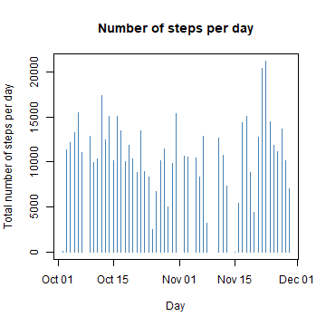
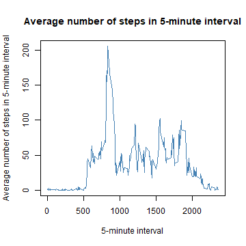
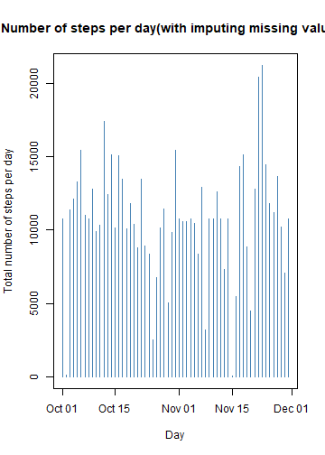
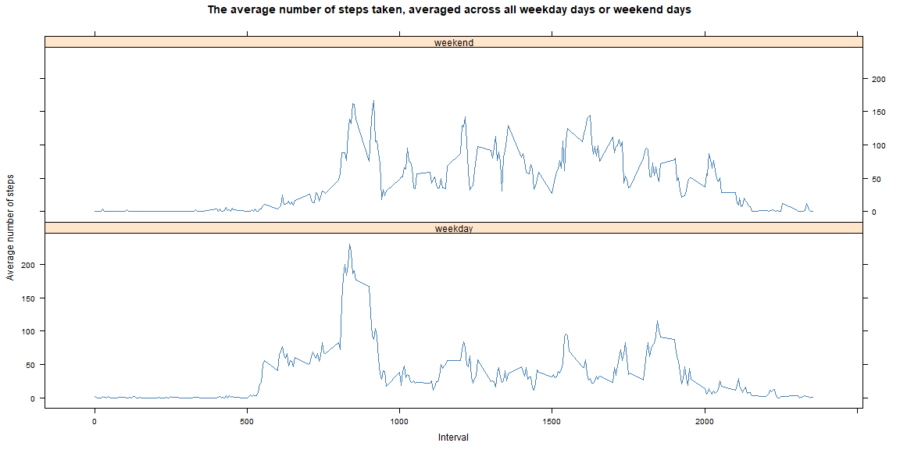

## Loading and preprocessing the data


```r
data <- read.csv("activity.csv", header = TRUE, na.string = "NA")
data$date <- as.Date(data$date)
head(data)
```

```
##   steps       date interval
## 1    NA 2012-10-01        0
## 2    NA 2012-10-01        5
## 3    NA 2012-10-01       10
## 4    NA 2012-10-01       15
## 5    NA 2012-10-01       20
## 6    NA 2012-10-01       25
```

## What is mean total number of steps taken per day?

Calculate the total number of steps taken per day.


```r
gp <- aggregate(steps ~ date, data, sum)
```

If you do not understand the difference between a histogram and a barplot, research the difference between them. Make a histogram of the total number of steps taken each day.


```r
with(gp, plot(date, steps, type = "h", xlab = "Day", 
               ylab = "Total number of steps per day", main = "Number of steps per day", 
               col = "steelblue"))
```



Calculate and report the mean and median of the total number of steps taken per day.


```r
paste("Mean steps per Day =", mean(gp$steps, na.rm = TRUE))
```

```
## [1] "Mean steps per Day = 10766.1886792453"
```

```r
paste("Median steps per Day =", median(gp$steps, na.rm = TRUE))
```

```
## [1] "Median steps per Day = 10765"
```

## What is the average daily activity pattern?

Make a time series plot (type="l") of the 5-minute interval (x-axis) and the average number of steps taken, averaged across all days (y-axis).


```r
gv <- aggregate(steps ~ interval, data, mean)
with(gv, plot(interval, steps, type = "l", xlab = "5-minute interval", 
              ylab = "Average number of steps in 5-minute interval", 
              main = "Average number of steps in 5-minute interval", col = "steelblue"))
```



Which 5-minute interval, on average across all the days in the dataset, contains the maximum number of steps?


```r
paste("Maximum number of steps, averaged across all days for 5-minute interval =", 
      max(gv$steps), "for", gv[which.max(gv$steps), 1], "interval")
```

```
## [1] "Maximum number of steps, averaged across all days for 5-minute interval = 206.169811320755 for 835 interval"
```

## Imputing missing values

Calculate and report the total number of missing values in the dataset (i.e. the total number of rows with NAs).


```r
paste("The total number of missing values in dataset is", length(which(is.na(data$steps))))
```

```
## [1] "The total number of missing values in dataset is 2304"
```

Create a new dataset that is equal to the original dataset but with the missing data filled in.


```r
newdata <- data
for (i in 1:nrow(newdata)) {
        if (is.na(newdata$steps[i]) == TRUE) {
                newdata$steps[i] <- gv$steps[which(gv$interval == newdata$interval[i])]
        }
        else {
                newdata$steps[i] <- newdata$steps[i]
        }
}
newdata$date <- as.Date(newdata$date)
nd <- aggregate(steps ~ date, newdata, sum)
```

Make a histogram of the total number of steps taken each day.


```r
with(nd, plot(date, steps, type = "h", xlab = "Day", 
              ylab = "Total number of steps per day", 
              main = "Number of steps per day(with imputing missing values)", 
              col = "steelblue"))
```



Calculate and report the mean and median total number of steps taken per day. Do these values differ from the estimates from the first part of the assignment? What is the impact of imputing missing data on the estimates of the total daily number of steps?


```r
paste("Mean steps per Day =", mean(nd$steps, na.rm = TRUE))
```

```
## [1] "Mean steps per Day = 10766.1886792453"
```

```r
paste("Median steps per Day =", median(nd$steps, na.rm = TRUE))
```

```
## [1] "Median steps per Day = 10766.1886792453"
```

If dataset has no missing values, then mean and median are equal to each other.  
Mean and median from dataset with NAs mean was greater than median. 

## Are there differences in activity patterns between weekdays and weekends?

Create a new factor variable in the dataset with two levels – “weekday” and “weekend” indicating whether a given date is a weekday or weekend day.


```r
weekdays <- c("Monday", "Tuesday", "Wednesday", "Thursday", "Friday")
newdata$day_of_week = as.factor(ifelse(is.element(weekdays(as.Date(newdata$date)),weekdays), "weekday", "weekend"))
```

Make a panel plot containing a time series plot (i.e.type="l") of the 5-minute interval (x-axis) and the average number of steps taken, averaged across all weekday days or weekend days (y-axis).


```r
ndw_av <- aggregate(steps ~ interval + day_of_week, newdata, mean)
library(lattice)
xyplot(ndw_av$steps ~ ndw_av$interval | ndw_av$day_of_week, type = "l", layout = c(1,2), 
       col = "steelblue", xlab = "Interval", ylab = "Average number of steps",
       main = "The average number of steps taken, averaged across all weekday days or weekend days")
```


